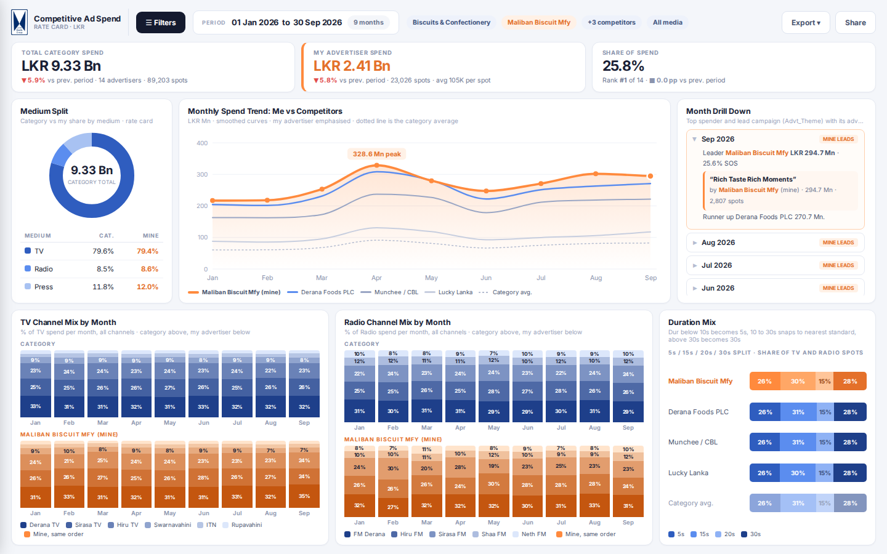

# Competitive Ad Spend Dashboard

A full-screen competitive media spend dashboard (John Keells Group branding) for Sri Lankan advertisers. Upload a spot log (`.xlsx` or `.csv`, 400k+ rows), choose a product group, pick your advertiser and your competitors, and compare spend, share of spend, medium split, channel mix and duration mix.



## Features

* Fills the whole browser window. Below 1280 x 720 it scales down to fit instead of scrolling.
* Filter drawer with two tabs: **Filters** (period and category, advertisers, media) and **Data file** (upload, delete, required columns). Apply and Reset stay pinned at the bottom.
* Daypart filter lists the time range for each bucket.
* TV and Radio channel mix show every channel as % of spend, darkest segment = biggest channel.
* Month Drill Down names the advertiser behind each lead campaign.
* **Export** menu: JPG (whole dashboard as one image), PDF (one landscape page), or CSV (monthly numbers).

## How it works

```
Browser (HTML, CSS, JS)  ──upload──▶  Node.js server on Railway
        ▲                              │ streams the file (ExcelJS / csv-parse)
        │ small JSON summaries          │ computes derived fields once
        └──── /api/dashboard ◀──────────┘ keeps compact typed arrays in memory + on disk
```

* Uploading a 45 MB `.xlsx` with 420,000 rows takes about 30 seconds and under 400 MB of RAM. The same data as `.csv` takes about 8 seconds.
* Every filter change runs one pass over the rows on the server (about 30 ms) and returns about 8 KB of JSON.
* The latest upload is saved to `DATA_DIR`, so it survives restarts. **Delete data** in the drawer removes it, and a new upload replaces it.

## Expected columns

`Product_Group, Advertiser, Product, Advt_Theme, Channel, Program, Dd, Mn, Yr, Day, Prog_time, Advt_time, AdPos, TotAds, BrkNo, PosinBrk, AdsinBrk, Lng, Dur, Cost`

Required: `Advertiser, Channel, Dd, Mn, Yr, Cost`. Header names are matched ignoring case, spaces and underscores. The header row can sit below a few title rows. Only the first worksheet of an `.xlsx` is read. Old `.xls` files are not supported, so save them as `.xlsx` or `.csv` first.

## Derived fields (computed once at upload)

| Field | Rule |
|---|---|
| Medium | Channel starting with `TV -` or containing `TV` is TV. Starting with `FM`, containing `FM`, or starting with `Radio -` is Radio. Everything else is Press. |
| ChannelName | Text after the `TV - ` / `FM - ` / `Radio - ` prefix. |
| Date, MonthKey | Built from `Dd`, `Mn`, `Yr`. `Mn` can be a number or a name (Jan). Rows with an invalid date are skipped and counted. |
| Daypart | Morning 05:00 to 12:00, Daytime 12:00 to 18:30, Prime 18:30 to 22:30, Late night 22:30 to 05:00, Not timed (no `Advt_time`, typical for Press). |
| Std_Dur | Below 10s becomes 5s. 10 to 30s snaps to the nearest of 15, 20, 30 (ties go up). Above 30s becomes 30s. |
| Break_Quality | `PosinBrk` = 1 or = `AdsinBrk` is Premium, otherwise Mid break. |
| Campaign | `Advt_Theme`. |

## Metrics

* **Spend** = `SUM(Cost)`, rate card, not net.
* **Category spend** = all advertisers in the product group and date range (and the medium, channel and daypart filters), not just the selected ones.
* **SOS %** = my spend / category spend.
* **Rank** = my advertisers combined as one entity, ranked against every other advertiser with spend.
* **Previous period** = the same number of days immediately before the start date.
* **Category avg.** (trend) = category spend in the month / advertisers active that month.
* **Channel mix** = every channel in the medium, ordered by category spend in the selection.
* **Duration mix** = share of TV and Radio spots by standardised duration (Press has no duration).
* **Month drill down** = the leader is the top spender in the whole category that month. The earliest run of quiet months (category spend below 80% of the monthly average, 2 or more months) is combined into one row.

## Run locally

```bash
npm install
npm start            # http://localhost:3000
npm test             # smoke tests for the derived fields and metrics
npm run sample       # writes samples/sample_420000.csv and .xlsx for testing
```

## Deploy on Railway

1. Push this repo to GitHub, then in Railway choose **New Project, Deploy from GitHub repo**.
2. Add a **Volume** to the service and mount it at `/data`.
3. Add the variable `DATA_DIR=/data`. Without a volume, the uploaded data is lost on each redeploy.
4. Optional variables: `MAX_UPLOAD_MB` (default 100).
5. Railway sets `PORT` automatically. Health check: `/api/status`.

Memory: the start script allows Node up to 3 GB. A 50 MB `.xlsx` needs roughly 400 to 600 MB while processing and about 150 MB after that.

## Security note

Anyone with the link can view, upload and delete data. There is no login. If you need one later, add a password check to `/api/upload` and `/api/data`.
