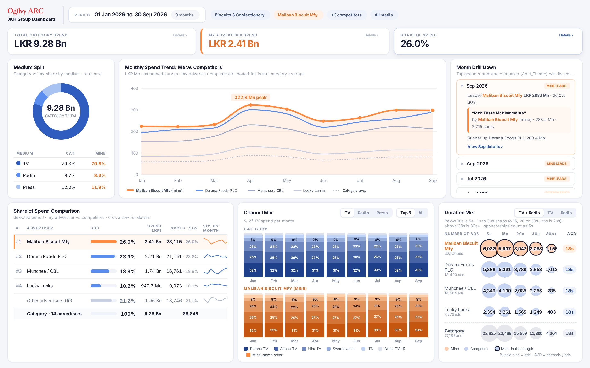

# JKH Group Dashboard

A full-screen competitive media spend dashboard by Ogilvy ARC for John Keells Group for Sri Lankan advertisers. Upload a spot log (`.xlsx` or `.csv`, 400k+ rows), choose a product group, pick your advertiser and your competitors, and compare spend, share of spend, medium split, channel mix and duration mix.



## Features

* Fills the whole browser window. Below 1280 x 720 it scales down to fit instead of scrolling.
* Filter drawer with two tabs: **Filters** (period and category, advertisers, media) and **Data file** (upload, delete, required columns). Apply and Reset stay pinned at the bottom.
* Daypart filter lists the time range for each bucket.
* **Ad type** filter: All (default), Commercials or Sponsorships. Sponsorships are the Advt_Theme items `-BB`, `Com Break`, `DJ`, `-Extro`, `-Intro`, `-LLogo`, `Next Card`, `Tag`, `Time Check`, `-Tr` (exact name, or ending in a dash marker such as `Summer Promo -BB`); everything else is a commercial. The choice applies to every card and pop-up, and Commercials + Sponsorships always add up to All. Sponsorship items always count in the 5s bubble of Duration Mix (ACD uses their real Dur, or 5 seconds when Dur is blank). They are skipped only when Month Drill Down picks its lead campaign (in All and Commercials; in Sponsorships the top item is shown); pop-up campaign lists include them like any other theme.
* **Share of Spend Comparison**: my advertiser, each competitor and all other advertisers for the selected period, with SOS, spend, spots, share of spots, rank and a month-by-month SOS line. Click a row for details (opens on a Months tab with share of category per month).
* **Channel Mix** with TV, Radio and Press toggles: **Top 5** stacked bars by default (the rest grouped as Other), with an **All channels** heatmap behind a toggle (Category or Mine).
* **Duration Mix** with TV + Radio, TV and Radio toggles (Press has no ad duration).
* Interactive: hover any bar, line, cell or segment for a tooltip; click it to open a details pop-up (Advertisers, Campaigns, Channels). Duration bubbles open only the ads of that length, campaigns open only that campaign. Click rows to drill deeper, use Back to return, and push a finding into the dashboard (zoom to a month, filter to a channel, add a competitor). Click legend items in the trend to hide or show lines. KPI cards open the rankings.
* Month Drill Down names the advertiser behind each lead campaign. Sponsorship and filler themes (`-BB`, `Com Break`, `DJ`, `-Extro`, `-Intro`, `-LLogo`, `Next Card`, `Tag`, `Time Check`, `-Tr`) are ignored when picking campaigns: exact match, or a name ending in a dash marker such as `Summer Promo -BB`. Override the list with `EXCLUDED_THEMES="a;b;c"`.
* **Export** menu: JPG images as a ZIP (the full dashboard plus each chart as its own branded JPG), PDF (one landscape page), or CSV (monthly numbers). Charts avoid SVG url() paint references so exports never render black.

## How it works

```
Browser (HTML, CSS, JS)  ──upload──▶  Node.js server on Railway
        ▲                              │ streams the file (ExcelJS / csv-parse)
        │ small JSON summaries          │ computes derived fields once
        └──── /api/dashboard ◀──────────┘ keeps compact typed arrays in memory + on disk
```

* Uploading a 45 MB `.xlsx` with 420,000 rows takes about 30 seconds and under 400 MB of RAM. The same data as `.csv` takes about 8 seconds.
* Every filter change runs one pass over the rows on the server (about 30 ms) and returns about 8 KB of JSON.
* The latest upload is saved to `DATA_DIR`, so it survives restarts. **Delete data** in the drawer removes it, and a new upload replaces it.

## Expected columns

`Product_Group, Advertiser, Product, Advt_Theme, Channel, Program, Dd, Mn, Yr, Day, Prog_time, Advt_time, AdPos, TotAds, BrkNo, PosinBrk, AdsinBrk, Lng, Dur, Cost`

Required: `Advertiser, Channel, Dd, Mn, Yr, Cost`. Header names are matched ignoring case, spaces and underscores. The header row can sit below a few title rows. Only the first worksheet of an `.xlsx` is read. Old `.xls` files are not supported, so save them as `.xlsx` or `.csv` first.

## Derived fields (computed once at upload)

| Field | Rule |
|---|---|
| Medium | Channel starting with `TV -` or containing `TV` is TV. Starting with `FM`, containing `FM`, or starting with `Radio -` is Radio. Everything else is Press. |
| ChannelName | Text after the `TV - ` / `FM - ` / `Radio - ` prefix. |
| Date, MonthKey | Built from `Dd`, `Mn`, `Yr`. `Mn` can be a number or a name (Jan). Rows with an invalid date are skipped and counted. |
| Daypart | Morning 05:00 to 12:00, Daytime 12:00 to 18:30, Prime 18:30 to 22:30, Late night 22:30 to 05:00, Not timed (no `Advt_time`, typical for Press). |
| Std_Dur | Below 10s is 5s. 10 to 30s snaps to the nearest of 15, 20, 30 (ties go down, so 25s is 20s). Above 30s is 30s+. Raw `Dur` is kept too, and the bucket is worked out at query time. |
| Break_Quality | `PosinBrk` = 1 or = `AdsinBrk` is Premium, otherwise Mid break. |
| Campaign | `Advt_Theme`. |

## Metrics

* **Spend** = `SUM(Cost)`, rate card, not net.
* **Category spend** = all advertisers in the product group and date range (and the medium, channel and daypart filters), not just the selected ones.
* **SOS %** = my spend / category spend.
* **Rank** = my advertisers combined as one entity, ranked against every other advertiser with spend.
* **Category avg.** (trend) = category spend in the month / advertisers active that month.
* **Channel mix** = every channel in the medium, ordered by category spend in the selection.
* **Duration mix** = a bubble grid of the number of ads (TV and Radio) per advertiser in each length bucket. The number is the ad count and bubble area follows it; advertisers share one scale and the category row has its own. The advertiser with the most ads in each length is ringed. Hover shows the % of that advertiser's ads. Press has no duration.
* **ACD** (average commercial duration) = sum of raw `Dur` / number of ads, for my advertiser, each competitor and the category, shown rounded to whole seconds.
* **Month drill down** = the leader is the top spender in the whole category that month. The earliest run of quiet months (category spend below 80% of the monthly average, 2 or more months) is combined into one row.

## Run locally

```bash
npm install
npm start            # http://localhost:3000
npm test             # smoke tests for the derived fields and metrics
npm run check        # cross-checks every drill-down total against its chart (needs npm run sample first)
npm run verify       # independent recount of every pop-up, row by row, from the raw CSV
npm run sample       # writes samples/sample_420000.csv and .xlsx for testing
```

## Deploy on Railway

1. Push this repo to GitHub, then in Railway choose **New Project, Deploy from GitHub repo**.
2. Add a **Volume** to the service and mount it at `/data`.
3. Add the variable `DATA_DIR=/data`. Without a volume, the uploaded data is lost on each redeploy.
4. Optional variables: `MAX_UPLOAD_MB` (default 100), `EXCLUDED_THEMES` (semicolon separated).
5. Railway sets `PORT` automatically. Health check: `/api/status`.

Memory: the start script allows Node up to 3 GB. A 50 MB `.xlsx` needs roughly 400 to 600 MB while processing and about 150 MB after that.

## Security note

Anyone with the link can view, upload and delete data. There is no login. If you need one later, add a password check to `/api/upload` and `/api/data`.
