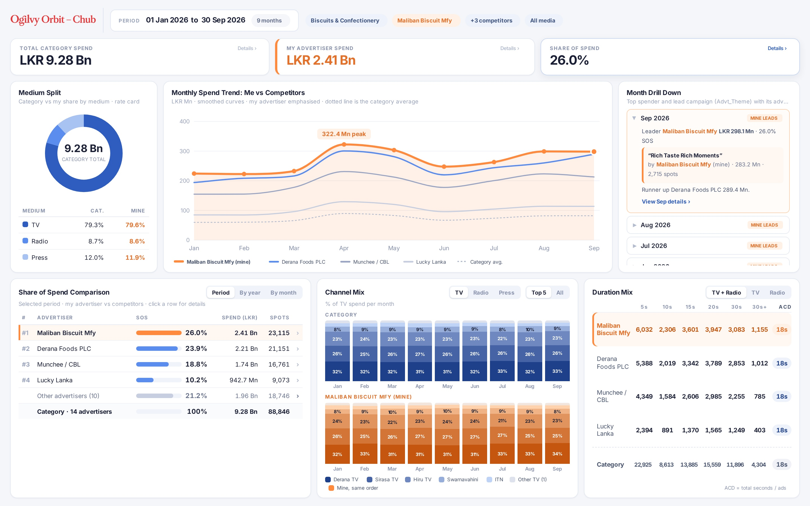

# Ogilvy Orbit – Chub

Ogilvy Orbit – Chub: a full-screen competitive media spend dashboard for Sri Lankan advertisers. Sign in with your Ogilvy email, load your own spot log (`.xlsx` or `.csv`, 400k+ rows; it is processed in your browser and only you see it), choose a product group, pick your advertiser and your competitors, and compare spend, share of spend, medium split, channel mix and duration mix.



## Features

* Fills the whole browser window. Below 1280 x 720 it scales down to fit instead of scrolling.
* Filter drawer with two tabs: **Filters** (period and category, advertisers, media) and **Data file** (load or remove your file, required columns). Apply and Reset stay pinned at the bottom.
* Daypart filter lists the time range for each bucket.
* **Ad type** filter: All (default), Commercials or Value Additions. Value Additions are the Advt_Theme items `-BB`, `Com Break`, `DJ`, `-Extro`, `-Intro`, `-LLogo`, `Next Card`, `Tag`, `Time Check`, `-Tr` (exact name, or ending in a dash marker such as `Summer Promo -BB`); everything else is a commercial. The choice applies to every card and pop-up, and Commercials + Value Additions always add up to All. Value addition items always count in the 5s bubble of Duration Mix (ACD uses their real Dur, or 5 seconds when Dur is blank). They are skipped only when Month Drill Down picks its lead campaign (in All and Commercials; in Value Additions the top item is shown); pop-up campaign lists include them like any other theme.
* **Share of Spend Comparison**: my advertiser, each competitor and all other advertisers for the selected period, with SOS, spend, spots and rank. Rows are sorted by SOS with my advertiser highlighted. A **Period | By year | By month** toggle switches to a grid of SOS %: **By year** covers every year in the full data (ignoring the date range; other filters apply; part years are marked), **By month** each month of the selected period (shaded, darker = bigger share). Click a row or cell for details (rows open on a Months tab with share of category per month).
* **Channel Mix** with TV, Radio and Press toggles: **Top 5** stacked bars by default (the rest grouped as Other), with an **All channels** heatmap behind a toggle (Category or Mine).
* **Duration Mix** with TV + Radio, TV and Radio toggles (Press has no ad duration).
* Interactive: hover any bar, line, cell or segment for a tooltip; click it to open a details pop-up (Advertisers, Campaigns, Channels). Duration bubbles open only the ads of that length, campaigns open only that campaign. Click rows to drill deeper, use Back to return, and push a finding into the dashboard (zoom to a month, filter to a channel, add a competitor). Click legend items in the trend to hide or show lines. KPI cards open the rankings.
* Month Drill Down names the advertiser behind each lead campaign. Value addition themes (`-BB`, `Com Break`, `DJ`, `-Extro`, `-Intro`, `-LLogo`, `Next Card`, `Tag`, `Time Check`, `-Tr`) are ignored when picking campaigns: exact match, or a name ending in a dash marker such as `Summer Promo -BB`. Override the list with `EXCLUDED_THEMES="a;b;c"`.
* **Export** menu: JPG images as a ZIP (the full dashboard plus each chart as its own branded JPG), PDF (one landscape page), PowerPoint (a title slide, the full dashboard, then one slide per chart), a **Planning report** (Markdown, see below), or CSV (monthly numbers). All image exports carry the stacked Ogilvy Orbit Chub logo. Charts avoid SVG url() paint references so exports never render black.

* **Sign-in** to the Live Dashboard: people create their own account with an Ogilvy email address, confirm it with a 6-digit code sent by email, and reset a forgotten password the same way. The top bar shows who is signed in, with **Sign out**.

## Admin panel

A separate admin area at **`/admin`** (link: "Automation team? Admin sign-in" on the login page, or **Admin panel** in the dashboard's user menu for admins). Admins sign in with their normal account at `/admin/login`; the admin session is separate from the dashboard one and lasts 12 hours.

* **Users:** everyone who signed up or was invited, with status (Online, Active, Not confirmed, Invited, Disabled), role, last active, last sign-in, devices and join date. Search, filter, and export to CSV.
* **Per person** (click a row): disable or enable, sign out everywhere, send a password reset code (24 hours, with a link), unlock after too many wrong passwords, confirm their email, make or remove admin, delete. Shows the devices they are signed in on and their recent activity. You cannot disable, delete or demote yourself.
* **Invite user:** enter a name and Ogilvy email; they get a code and a link to set their own password (valid 3 days), optionally with admin access.
* **Activity:** the last 500 sign-ins, wrong passwords, blocked attempts, sign-ups, resets and admin actions with IP address and who did it.
* **Settings:** read-only view of the Railway variables that control sign-in.

The first admin comes from **`ADMIN_EMAILS`** on Railway (comma separated). Those people are always admins; anyone else can be made admin from the panel.

## Planning report (Markdown)

**Export, Planning report** downloads one `.md` file with every number a planning tool needs to read competitor behaviour, for the filters on screen:

1. Settings and definitions (SOS, SOV, ACD, duration buckets, Value Additions, dayparts) and auto-written key facts per competitor.
2. Competitor summary for **every** advertiser in the category: rank, spend, SOS, spots, SOV, cost per spot, ACD, active months, channels, campaigns, TV/Radio/Press %, Commercials vs Value Additions %, first and last spot.
3. Monthly spend, monthly SOS and monthly spots (mine, each competitor, other advertisers, category).
4. Medium mix, channel mix (% of each advertiser's spend, every channel) and channel spend/spots.
5. Daypart mix, and duration mix (TV + Radio, TV, Radio) with ACD.
6. Top campaigns per advertiser with spend, spots, months active, dates and channels, and the leader of each month.
7. A flat **advertiser x month x channel** table (spend in whole LKR, spots, ACD, share of the advertiser's month and of the channel's month), ready to import or pivot.

## How it works

```
Your browser                                             Node.js server on Railway
  page (HTML, CSS, JS)                                     sign-in, admin panel, Postgres accounts
  data engine (Web Worker) ◀── engine code (/engine/lib) ─ serves the app and the engine code
    reads your .xlsx / .csv on this computer               never receives data files
    keeps compact typed arrays in memory
    saves them in this browser (IndexedDB, per account)
```

* **Each person has their own data.** The file someone chooses is read and analysed in their own browser and never sent to the server, so several people can work with different files at the same time without seeing or replacing each other's data. A new person, or a new computer, starts with an empty dashboard.
* **It stays until you remove it.** The processed data is saved in that browser under the signed-in account and reopens automatically on the next visit; **Remove data** deletes it. Another person signing in on the same browser gets their own, separate slot.
* The browser runs exactly the same calculation code as the test scripts verify (`server/derive.js`, `builder.js`, `compute.js`, `planning.js`), and `npm run test:readers` proves the browser readers build an identical dataset to the Node reader.
* Reading the 420,000-row sample takes about 3 seconds as `.csv` and 9 seconds as a 45 MB `.xlsx` (streamed, so memory stays low). Every filter change is one pass over the rows (about 30 ms) on the person's computer.

## Expected columns

`Product_Group, Advertiser, Product, Advt_Theme, Channel, Program, Dd, Mn, Yr, Day, Prog_time, Advt_time, AdPos, TotAds, BrkNo, PosinBrk, AdsinBrk, Lng, Dur, Cost`

Required: `Advertiser, Channel, Dd, Mn, Yr, Cost`. Header names are matched ignoring case, spaces and underscores. The header row can sit below a few title rows. Only the first worksheet of an `.xlsx` is read. Old `.xls` files are not supported, so save them as `.xlsx` or `.csv` first.

## Derived fields (computed once when a file is loaded)

| Field | Rule |
|---|---|
| Medium | Channel starting with `TV -` or containing `TV` is TV. Starting with `FM`, containing `FM`, or starting with `Radio -` is Radio. Everything else is Press. |
| ChannelName | Text after the `TV - ` / `FM - ` / `Radio - ` prefix. |
| Date, MonthKey | Built from `Dd`, `Mn`, `Yr`. `Mn` can be a number or a name (Jan). Rows with an invalid date are skipped and counted. |
| Daypart | Morning 05:00 to 12:00, Daytime 12:00 to 18:30, Prime 18:30 to 22:30, Late night 22:30 to 05:00, Not timed (no `Advt_time`, typical for Press). |
| Std_Dur | 1 to 9s is 5s. 10 to 30s snaps to the nearest of 10, 15, 20, 30 (ties go down, so 12.5s is 10s and 25s is 20s). Above 30s is 30s+. Value additions always count as 5s. Raw `Dur` is kept too, and the bucket is worked out at query time. |
| Break_Quality | `PosinBrk` = 1 or = `AdsinBrk` is Premium, otherwise Mid break. |
| Campaign | `Advt_Theme`. |

## Metrics

* **Spend** = `SUM(Cost)`, rate card, not net.
* **Category spend** = all advertisers in the product group and date range (and the medium, channel and daypart filters), not just the selected ones.
* **SOS %** = my spend / category spend.
* **Rank** = my advertisers combined as one entity, ranked against every other advertiser with spend.
* **Category avg.** (trend) = category spend in the month / advertisers active that month.
* **Channel mix** = every channel in the medium, ordered by category spend in the selection.
* **Duration mix** = a grid of the number of ads (TV and Radio) per advertiser in each length bucket, with my advertiser's row highlighted. Hover shows the % of that advertiser's ads. Press has no duration.
* **ACD** (average commercial duration) = sum of raw `Dur` / number of ads, for my advertiser, each competitor and the category, shown rounded to whole seconds.
* **Month drill down** = the leader is the top spender in the whole category that month. The earliest run of quiet months (category spend below 80% of the monthly average, 2 or more months) is combined into one row.

## Run locally

```bash
npm install
npm start            # http://localhost:3000 (sign-in codes print to the log until APPS_SCRIPT_URL is set)
npm test             # smoke tests for the derived fields, metrics and planning report
npm run test:readers # browser .xlsx/.csv readers build exactly the same dataset as the Node reader
npm run test:auth    # sign-up, email code, sign-in, reset and the admin panel API, end to end
TEST_DATABASE_URL=postgres://user@host:5432/postgres npm run test:db   # accounts survive restarts with an empty disk (uses a throwaway database)
npm run check        # cross-checks every drill-down total against its chart (needs npm run sample first)
npm run verify       # independent recount of every pop-up, row by row, from the raw CSV
npm run sample       # writes samples/sample_420000.csv and .xlsx for testing
```

## Deploy on Railway

1. Push this repo to GitHub, then in Railway choose **New Project, Deploy from GitHub repo**.
2. No volume is needed for data files: they stay in each person's browser. (`DATA_DIR` only holds the accounts file when there is no database.)
3. Optional variable: `EXCLUDED_THEMES` (semicolon separated) for the Node test scripts; the browser uses the default Value Additions list.
4. Accounts need the Postgres database below.
5. Railway sets `PORT` automatically. Health check: `/healthz` (open without sign-in).
6. Add a **Postgres** database to the project and give this service `DATABASE_URL` (see "Accounts database" below). Without it, accounts are lost on every redeploy.
7. Set up email for the sign-in codes (next section), and set `ADMIN_EMAILS` to your own Ogilvy email so you can open the admin panel.

## Accounts database (Postgres)

Accounts, sessions, codes and the activity log are stored in Postgres when the service has a `DATABASE_URL`, so they survive redeploys.

1. In the Railway project: **New, Database, Add PostgreSQL** (skip if you already have one).
2. Open this app's service, **Variables, New Variable, Add Reference**, pick the Postgres service's `DATABASE_URL`. It shows up as `DATABASE_URL=${{Postgres.DATABASE_URL}}`.
3. Redeploy. The log should say `Sign-in accounts are stored in Postgres ...`, `/healthz` returns `"accounts":"postgres"`, and the admin panel's Settings page shows **Postgres database**.

The app creates its tables on start (`ooc_users`, `ooc_sessions`, `ooc_codes`, `ooc_events`); `ooc_users` has readable columns (email, name, role, verified, disabled, last login) and only scrypt password hashes. If the database is unreachable at start, the app stops and Railway restarts it rather than running with no accounts. An old `auth.json` in `DATA_DIR` is imported once into an empty database. Without `DATABASE_URL`, accounts fall back to `DATA_DIR/auth.json`, and the admin panel shows a warning.

## Sign-in emails (Google Apps Script)

The 6-digit codes are sent through a small Google Apps Script web app, so no SMTP setup is needed (Railway blocks SMTP on Trial and Hobby plans).

1. Open [script.google.com](https://script.google.com) with the Google account that should send the emails, create a project and paste in [`docs/apps-script-mailer.gs`](docs/apps-script-mailer.gs).
2. Project Settings, Script properties: add `MAIL_SECRET` with a long random value.
3. Deploy, New deployment, Web app, Execute as **Me**, Who has access **Anyone**. Copy the `/exec` URL.
4. On Railway add `APPS_SCRIPT_URL` (that URL) and `APPS_SCRIPT_SECRET` (the same random value).

| Variable | Default | Purpose |
| --- | --- | --- |
| `APPS_SCRIPT_URL` | none | Apps Script web app URL. Without it, codes are printed to the server log instead of emailed (handy locally). |
| `APPS_SCRIPT_SECRET` | none | Shared secret the script checks before sending. |
| `ALLOWED_EMAIL_DOMAINS` | `ogilvy.com` | Comma separated list of email domains allowed to sign up. |
| `SESSION_DAYS` | `30` | How long a sign-in lasts on a device. |
| `DATABASE_URL` | none | Postgres connection string (a reference to the Railway Postgres service). Keeps accounts across redeploys. `PGSSL=0` or `1` overrides TLS (default: off on the private network, on for public hosts). |
| `ADMIN_EMAILS` | none | Comma separated emails that are always admins. Set at least one, or nobody can open the admin panel. |
| `ADMIN_SESSION_HOURS` | `12` | How long an admin panel sign-in lasts. |
| `AUTH_DISABLED` | off | `1` switches sign-in off. Local development and automated tests only. |

Accounts are stored in Postgres (or `DATA_DIR/auth.json` without a database). Passwords are scrypt hashes; codes and session tokens are stored only as SHA-256 hashes. Codes expire after 10 minutes, allow 5 attempts and can be re-sent once a minute; 8 wrong passwords lock an email for 15 minutes; a password reset signs out every other device. Gmail allows about 100 emails a day (Workspace 1,500).

Memory: the server no longer holds datasets, so a small Railway plan is enough. Each person's browser uses roughly 200 to 400 MB while reading a 50 MB `.xlsx`.

## Security note

Every page and API call except the sign-in pages, their images and `/healthz` needs a signed-in Ogilvy account; the admin panel and its API also need an admin session. Data files never reach the server: each signed-in person loads and removes their own data in their browser.
